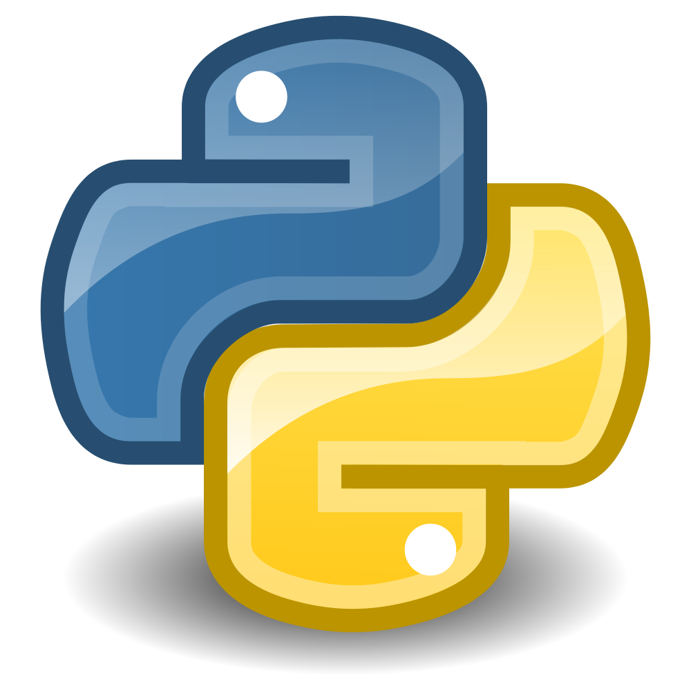

# Hi there 👋, Welcome to my profile in Github!
# Olá 👋, Seja bem vindo(a) ao meu perfil no Github!

## Um pouco sobre a minha pessoa/about me

   Sou estudante do Ensino Superior, no curso de Engenharia da Computação, o qual curso
no Centro Federal de Educação Tecnológica de Minas Gerais (CEFET-MG), sou completamente
apaixonado pela computação, área a qual ja trabalho desde os 16 anos de idade, quando 
tive a primeira experiencia na empresa CEVA SAÚDE ANIMAL, tenho em mente navegar nesse
mundo da computação, compartilhando com meus companheiros tudo que aprendi, proporcinando
evolução mutua, e trabalho produtivo por onde passar na minha carreira.

   Sinta se a vontade para conhecer um pouco mais meus projetos e a maneira como
programo, aqui estão meus melhores projetos ja desenvolvidos, tive o imenso prazer
de disponibiliza-los aqui para que você pudesse sentir um pouco do meu conhecimento
nas linguagens que aprendi durante minha formação acadêmica.

 

&nbsp;&nbsp;&nbsp;&nbsp;&nbsp;&nbsp;&nbsp;&nbsp;&nbsp;&nbsp;&nbsp;&nbsp;&nbsp;&nbsp;&nbsp;&nbsp;&nbsp;&nbsp;&nbsp;&nbsp;&nbsp;&nbsp;&nbsp;&nbsp;&nbsp;&nbsp;&nbsp;&nbsp;&nbsp;&nbsp;&nbsp;&nbsp;&nbsp;&nbsp;&nbsp;&nbsp;&nbsp;&nbsp;&nbsp;&nbsp;&nbsp;&nbsp;&nbsp;&nbsp;&nbsp;&nbsp;&nbsp;&nbsp;&nbsp;&nbsp;&nbsp;&nbsp;&nbsp;&nbsp;&nbsp;&nbsp;&nbsp;

<!--
**frankleitelemoscosta/frankleitelemoscosta** is a ✨ _special_ ✨ repository because its `README.md` (this file) appears on your GitHub profile.

Here are some ideas to get you started:

- 🔭 I’m currently working on ...
- 🌱 I’m currently learning ...
- 👯 I’m looking to collaborate on ...
- 🤔 I’m looking for help with ...
- 💬 Ask me about ...
- 📫 How to reach me: ...
- 😄 Pronouns: ...
- ⚡ Fun fact: ...
-->
